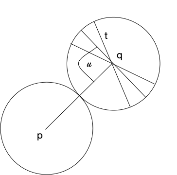

#Notes on calculating angles

We have a distribution of angles u with a standard deviation of o. We wish to calculate a margin m which we can use to adjust the distances used to calculate inclusion/exclusion. The diagram below shows a pivot and a query along with the mean angle u and one standard deviation from the mean.

We can take the mean angle u and calculate a safe minimum from which we can calculate the margin m based on (say) three times the standard deviation. To calculate this margin we first calculate a new internal angle a = u – 3o. From this,
	l = sqrt( 2 t^2 – 2t cos(2a) )
From this we calculate d (by Pythagoras) :
	d = sqrt(  t^2 + (l/2)^2 ) 
	
Finally we can calculate m = t - d

We can then use m to recalculate the exclusion properties by calculating a margin t + m rather than t for ball exclusion.